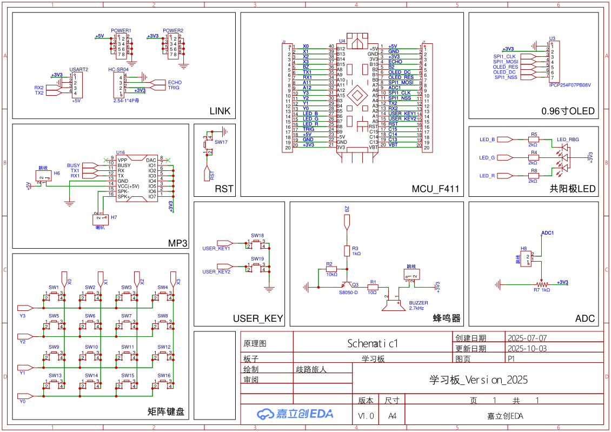

# CAST Edu Board 2025

> This is an updated version of CAST Edu Board 2024, with revised circuit design and enhanced code features.  
> Original project copyright: Copyright (C) 2024 ArcticLampyrid, insmtr.  
> This hardware revision copyright: Copyright (C) 2025 CNVHK, yhy.

Choose your language:  
- [English](./README.md)  
- [简体中文](./README-zh.md)

## Introduction
CAST Edu Board 2025 is designed by the School of Telecommunication Student Association (CAST) for internal educational use.  
The demo program is written in C++, built on the HAL library, and located in the `mcu/` directory.

Note: While the demo program and schematic are open-source and available in this repository, **the PCB design is NOT open-source**.

You may use this project for any purpose, provided you comply with the license requirements.

## Hardware

### Preview
  


### Schematic


### Features
- All pins routed to headers  
- 128×64 monochrome OLED display  
- MP3 music player module  
- 4×4 matrix keypad  
- 2 standalone push-buttons  
- Adjustable ADC resistor  
- RGB LED  
- Buzzer  
- Fun games

## Demo Program

### Copyright
```
Copyright (C) 2024 ArcticLampyrid <alampy.com>, insmtr <insmtr@insmtr.cn>
This program is free software: you can redistribute it and/or modify
it under the terms of the GNU Affero General Public License as
published by the Free Software Foundation, either version 3 of the
License, or (at your option) any later version.

This program is distributed in the hope that it will be useful,
but WITHOUT ANY WARRANTY; without even the implied warranty of
MERCHANTABILITY or FITNESS FOR A PARTICULAR PURPOSE.  See the
GNU Affero General Public License for more details.

You should have received a copy of the GNU Affero General Public License
along with this program.  If not, see <https://www.gnu.org/licenses/>.
```

### Features
- Animated user-interface design  
- Tone generation via buzzer  
- Breathing-effect RGB LED  
- Keyboard test module  
- MP3 music playback module  
- Fun games: Snake, Dino-Run, Minesweeper, Arduboy 3-D Dungeon

### Build & Flash
1. Install the ARM Embedded GCC toolchain (`arm-none-eabi-gcc`) and CMake.  
2. Install OpenOCD.  
3. Add tools to your PATH:
   ```bash
   export PATH=$PATH:/path/to/gcc-arm-none-eabi/bin
   export PATH=$PATH:/path/to/openocd/bin
   ```
4. Build with CMake:
   ```bash
   cd mcu
   cmake -S . -B build -DCMAKE_BUILD_TYPE=Release
   cmake --build build --config Release
   ```
5. Flash with OpenOCD:
   ```bash
   cd mcu
   openocd -f interface/cmsis-dap.cfg -f target/stm32f4x.cfg -c "init" -c "halt" -c "stm32f4x unlock 0" -c "reset halt" -c "flash write_image erase build/cast_edu_board_2025.elf" -c "reset" -c "shutdown"
   ```
   > Replace `interface/cmsis-dap.cfg` with your debugger’s config if necessary.

### Development
CLion is recommended for opening this project.

## License
This project is licensed under the GNU Affero General Public License v3.0 or later.  
See [LICENSE](LICENSE.md) for full details.

In general, you may use this project for any purpose, including commercially.  
However, you must keep the entire project open-source under the same license and provide complete source code to all users.

Selling the source code is allowed, but you must supply the license and full source code without additional restrictions.

Furthermore, the name “CAST” is reserved for the School of Telecommunication Student Association (CAST).  
If you redistribute or modify this project, please **change the project name** and remove “CAST” from it, while keeping the original author list intact.

> *(This is not legal advice—refer to the [LICENSE](LICENSE.md) file for the full terms.)*

## Authors
[2024]  
- Firmware development: [ArcticLampyrid](https://alampy.com), [insmtr](https://blog.insmtr.cn)  
- Firmware testing: [ArcticLampyrid](https://alampy.com), [insmtr](https://blog.insmtr.cn)  
- Hardware design: Mian Wang  

[2025]  
- Firmware development: [CNVHK (ElectroByte)](https://cnvhk.top), [yhy](xxx)  
- Firmware testing: [CNVHK (ElectroByte)](https://cnvhk.top), [yhy](xxx)  
- Hardware design: YuZhe Wang
